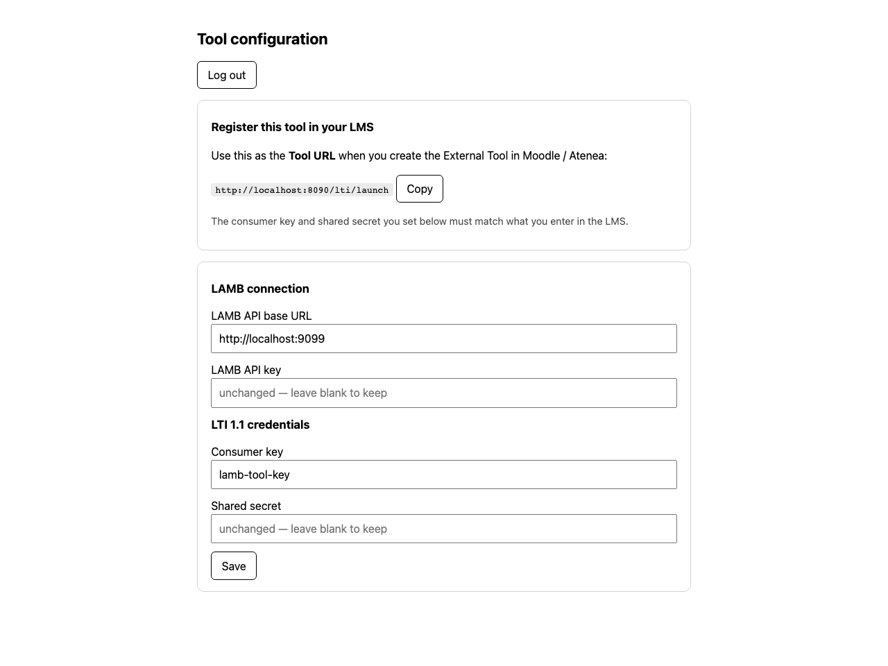
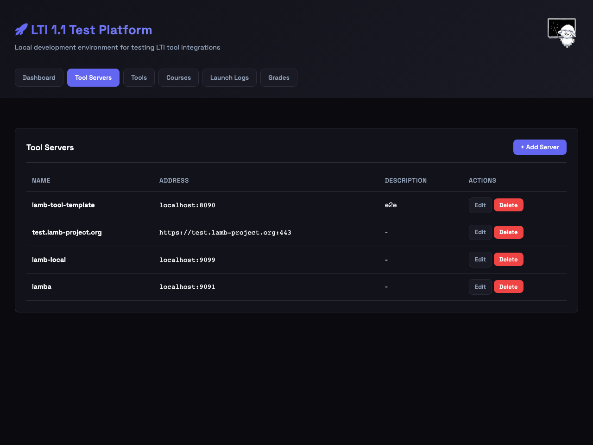
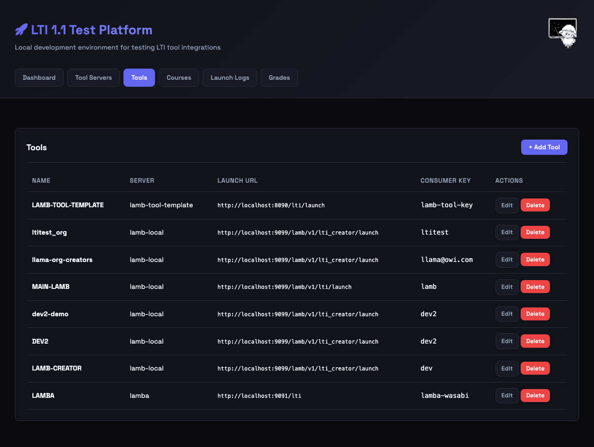
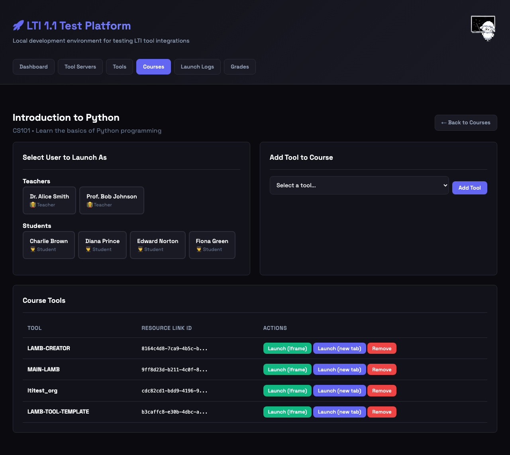
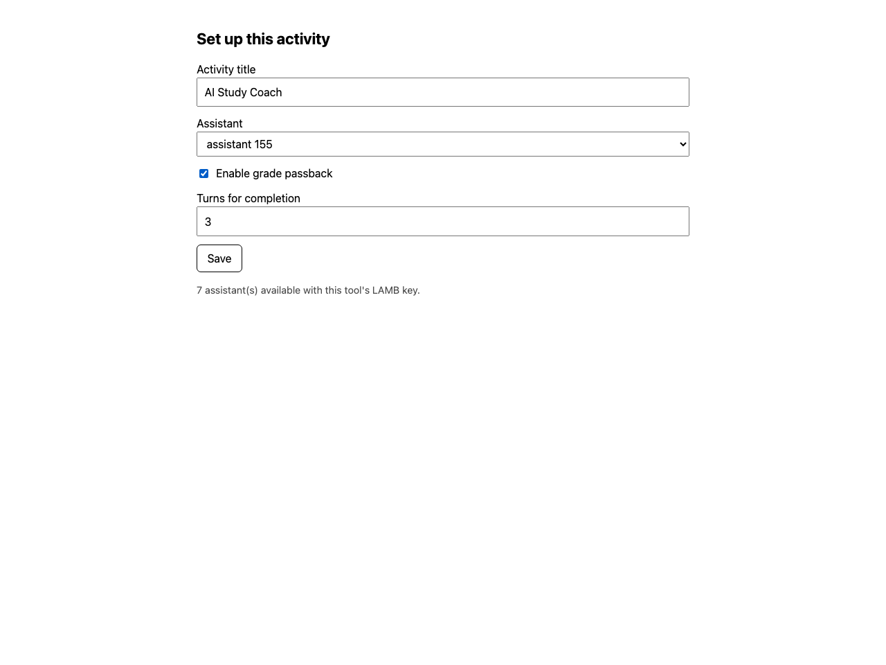
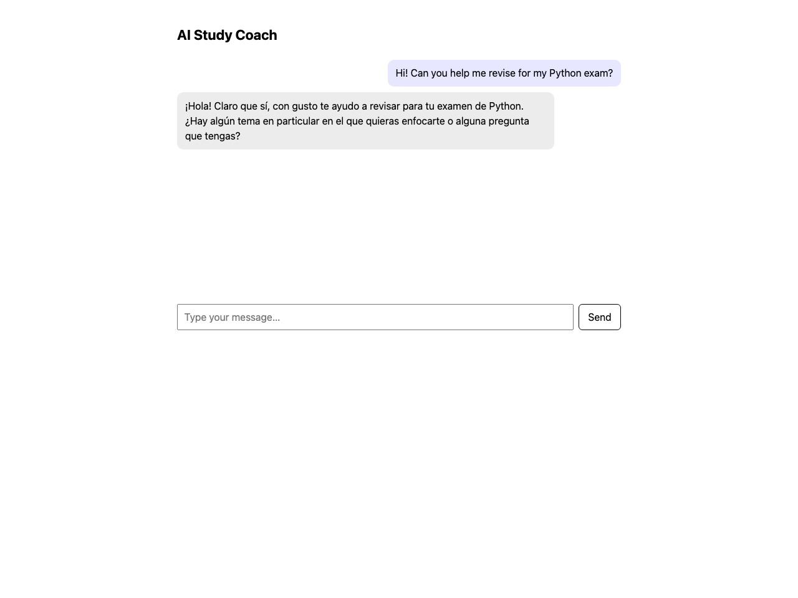
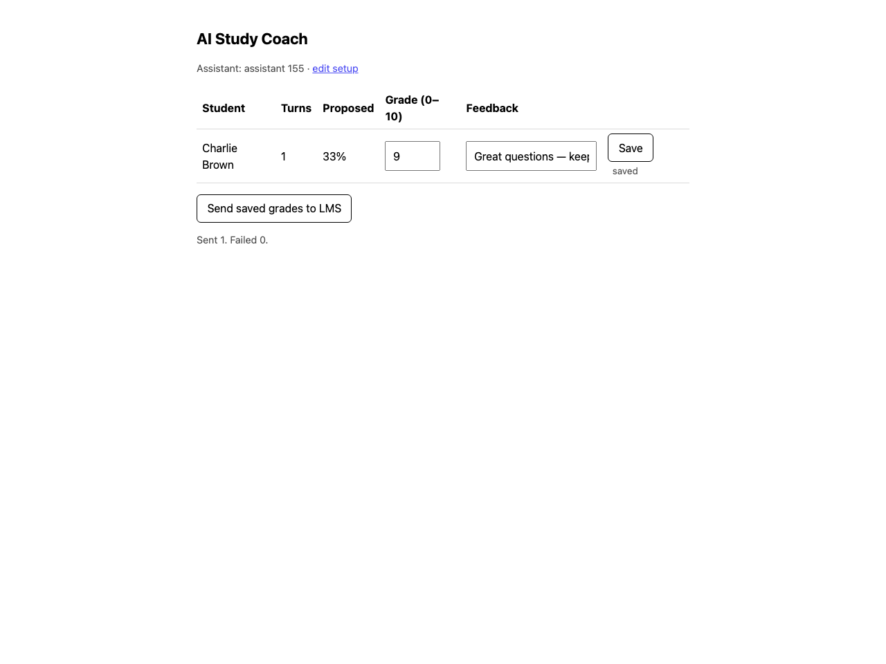
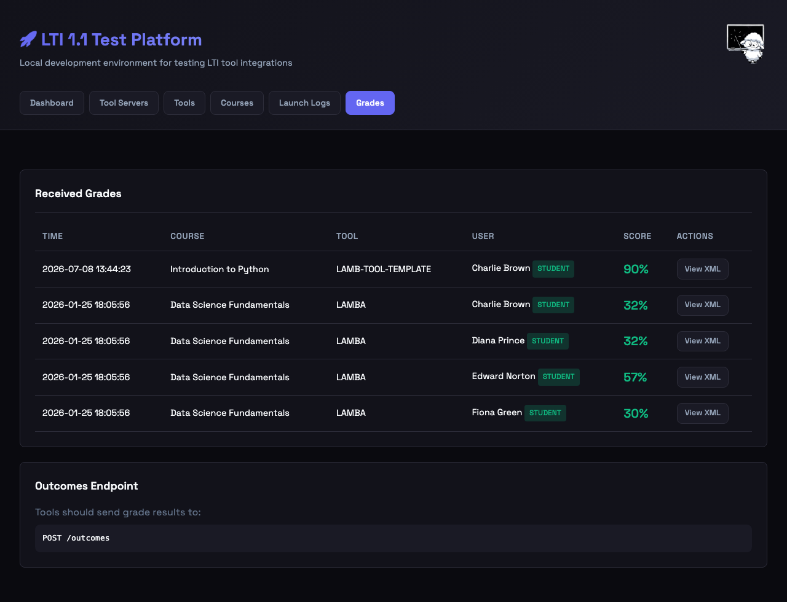

# Testing the tool with the LAMB LTI Test Tool

This is a hands-on walkthrough: set up the template, register it in a mock
LMS, and run the whole flow — instructor setup, student chat against a LAMB
assistant, and grade passback — without needing Moodle or Atenea.

You'll run three things, all locally:

| Service | Port | What it is |
|---|---|---|
| **LAMB** | 9099 | Your LAMB instance (the AI engine) |
| **This tool** | 8090 | `lamb-tool-template`, the thing you're testing |
| **[LAMB LTI Test Tool](https://github.com/Lamb-Project/lamb-lti-test-tool)** | 8001 | A mock LMS that launches your tool and receives grades |

> **Port note.** The test tool defaults to `:8000`. On a LAMB dev box that
> often collides with other services (e.g. a local `llama-server`), so this
> guide runs it on `:8001`.

## 0. Start the three services

```bash
# LAMB — however you run it (e.g. docker compose up in your LAMB checkout)

# This tool (see the main README for .env)
cd lamb-tool-template
uvicorn app.main:app --port 8090

# The mock LMS
cd lamb-lti-test-tool
pip install -r requirements.txt
uvicorn app:app --port 8001
```

## 1. Configure the tool (admin console)

Open **`http://localhost:8090/admin`** and log in with the
`ADMIN_USERNAME` / `ADMIN_PASSWORD` from your `.env`. Set:

- **LAMB API base URL** and **API key** — how the tool reaches LAMB.
- **LTI consumer key** and **shared secret** — any values you like; you'll
  enter the *same* ones in the mock LMS in the next step.

The page also shows the **Tool URL** (`…/lti/launch`) to register in the LMS.



## 2. Register the tool in the mock LMS

### 2a. Add a tool server

In the test tool, go to **Tool Servers** and add one pointing at this tool:
domain `localhost`, port `8090`.



### 2b. Create a tool

Under **Tools**, create a tool on that server with launch path
`/lti/launch` and the **same consumer key + secret** you set in step 1.



### 2c. Add the tool to a course

Open a course and add the tool. This creates a unique `resource_link_id`
for the course activity, and gives you **Launch** buttons for each demo user
(teachers → Instructor, students → Learner).



## 3. Launch as an instructor → set up the activity

Click **Launch** as a teacher. The mock LMS signs an LTI 1.1 launch and
POSTs it to your tool; the tool verifies the signature and, on the first
instructor launch, shows the **setup page**. Give the activity a title, pick
a LAMB assistant (the list comes live from LAMB's `/v1/models`), and choose
whether grades pass back.



## 4. Launch as a student → chat

Launch as a student. They land in the **chat**, bound to the assistant the
instructor chose. Messages stream back from the LAMB assistant in real time.



## 5. Grade and pass back

Launch as the instructor again — now you get the **dashboard**: who
participated, how many turns, a proposed completion score, and an editable
grade + feedback per student. Set a grade, save it, then **Send saved grades
to LMS**.



The grade travels back to the mock LMS as an LTI `replaceResult`, and shows
up on its **Grades** page.



## Doing it all automatically

Everything above is scripted in **`tests/e2e_full.py`** — it registers the
tool, launches both roles, chats, grades, and asserts the grade round-trip
(12 checks). The screenshots in this guide are produced by
**`tests/capture_screens.py`**. Both need the dev dependencies:

```bash
pip install -r requirements-dev.txt
python -m playwright install chromium
python tests/e2e_full.py          # the full assertion run
python tests/capture_screens.py   # refresh the images in docs/img/
```

See [`dev-harness.md`](dev-harness.md) for more on the mock-LMS loop.
